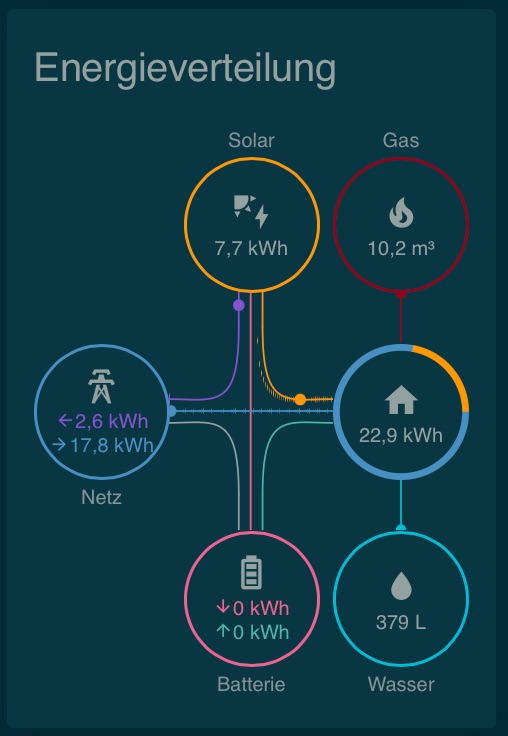

# Embedding a gas meter using home assistant ESPhome

In this repo I am going to document my setup for reading my gas meter using a ESP8266 and a reed sensor and display it in Home Assistant.

It is based on [this blog post by Benni](https://be-jo.net/2022/02/home-assistant-gaszaehler-mit-esphome-auslesen-flashen-unter-wsl/) translating it to English, adding some more details on the overall setup and extending it with (for me) important features.

First of all let's have a look at what we want to achieve:




# Needed hardware

## Home Assistant

If you don't have a running installation of Home Assistant you will need some hardware to run it on. There are many options [as described on this page](https://www.home-assistant.io/installation/) but be aware it should be a 24/7 running machine so most people are either running it on a Raspberry Pi or a NUC. I am running it on a Raspberry Pi 3 (and will upgrade to a 4 the moment they get back to normal prices).

## The sensor

The sensor is based on a ES2866 board which you can get from many source incl. Amazon. Be aware there are many, many replicas in the market, I personally have chosen [this D1 Mini](https://www.amazon.de/dp/B0754N794H?psc=1&ref=ppx_yo2ov_dt_b_product_details).

Next to this you need a so called reed sensor which is going to react on the actual gas meter which has an electromagnet inside.

Next you need an USB power source (USB micro if you choose the same D1 Mini as I did).

Finally some short electronic cables and a soldering iron.

So the costs of the ESP8266 and the reed sensor are below 10€ in total.

## Optional: a nice case

As I also own a 3D printer I have printed [a nice case for the my gas meter produced by Elster](https://www.thingiverse.com/thing:5574503) but your gas meter may vary and the case is not strictly needed. Some duct tape will do the job as well.

## Wiring the sensor

The one single place where you have to use your soldering iron is the wiring of the sensor. 

The reed sensor comes with two legs which need to be solded to the pins G (Ground) and D1 (GPIO5) on the ESP8266 board.

# Flashing the ESP8266

Flashing an ESP8266 with ESPHome is very easy and multiple ways exist depending where you have installed ESPHome.

I am not using the [Home Assistant Addon](https://www.home-assistant.io/addons/esphome/) which is the easiest way to get started but instead did all the work on my laptop (MacBook Pro) where I have installed `esphome` using [Homebrew](https://brew.sh/) with `brew install esphome`.

Whatever way you choose for the very first initial flash the ESP8266 needs to be connect to your computer using a USB micro cable.

For this guide I assume you have also installed ESPHome locally on your computer and the ESP8266 is connected to your computer.

If this is the case we can now move in the shell into the subfolder [./esphome] in this repository and start customizing the file `gas_meter.yaml` to your needs.

## The YAML files in details

I have added the 📝 symbol every time when you need to adjust a parameter to your needs.

```yaml
esphome:
  name: gas_meter
```

This is the general section describing the name of the integration as it will show up later in `Home Assistant`. Filename and name should be the same.

```yaml
platform: ESP8266
  board: d1_mini
```

This section descibes which board you are using - I have set it to my `D1 Mini` as shown above in needed hardware

```yaml
  restore_from_flash: true

preferences:
  flash_write_interval: 5min
```

This is the first change to the above linked blog post: it tells the ESPHome to store some variables (which will be defined later) in its (very limited) internal flash memory. Because of this I can power off the ESP8266 and it will still remember the last value of the gas meter.

The flash on this board is (according what I have read) not very reliable so I have set the interval to only 5 minutes. Still often enough so difference if the power is disconnected will be minimal and the flash should be OK for a long time (I hope - otherwise I will have to invest another 5 EUR in a new board).

```yaml
# Enable logging
logger:
```

Here we simply enable logging - you can later connect to the device and see what it is doing currently.

```yaml
api:
  password: "xxxxx"
```

This enables the API which will be used for the connection between the ESP8266 and Home Assistant. The password is the password you will need to enter in Home Assistant to connect to the device. 

📝 Set the password and remember it for later usage in `Home Assistant`.

```yaml
  services:
    - service: update_counter_pulses
      variables:
        counter_pulses: int
      then:
        - globals.set:
            id: pulses_sum
            value: !lambda 'return counter_pulses;'
```

This is the second addition I have done compared to the blog post mentioned in the very beginning.

Assuming we had a power outage or we did to read some cycles from our gas meter we can use this API to easily adjust the last known value on the fly using a service within Home Assistant (more details later when we confgure Home Assistant).

```yaml
ota:
  password: "xxxx"
```

ESPHome comes with the phantastic option to update the firmware over the air (OTA) after the initial flash is completed using USB. This password will protect your device against unwanted updates.

📝 Set the password.

```yaml
wifi:
  ssid: "xxxxx"
  password: "xxxxxxx"

  # Enable fallback hotspot (captive portal) in case wifi connection fails
  ap:
    ssid: "Gas_Meter Fallback Hotspot"
    password: "xxxxxxxx"

captive_portal:
```

The first section is about how the ESP8266 should connect to your WiFi network. Provide here the SSID of your WiFi network and the password.

📝 Set SSID and the password 

In case you mistyped the credentials or it is not reachable out of other reasons the ESP8266 will create a fallback WiFi network which you can connect to and configure it again without needing to connect it via USB again.

📝 Set the password 

The captive portal provides an easy to use webinterface in the fallback access point to change SSID and password without even needing to flash.

```yaml
globals:
  - id: pulses_sum
    type: int
    restore_value: yes
    initial_value: '1460546'  # here we can intialize the value to the value we have read from the gas meter.
```

This is the actual variable which stores and updates the gas meter value. Note it is based on pulses where are 1/100 of the value. So the above example actually represents `14650,46`.

The parameter `restore_value` tells the ESP8266 to restore the value from the flash memory after a power outage. This is the corresponding change to the above `restore_from_flash` and tells the ESPHome that this variable should be stored in the flash memory.

```yaml
binary_sensor:
  - platform: gpio
    id: internal_pulse_counter
    pin:
      number: GPIO5
      mode: INPUT_PULLUP
    name: "Live-Impuls"
    filters:
      - delayed_on: 10ms
    on_press:
      then:
        - lambda: id(pulses_sum) += 1;
```

This is function being executed when a pulse is read from the gas meter and the reed sensor (when the last digit has done a full turn). Please remember [credits to Benni](https://be-jo.net/2022/02/home-assistant-gaszaehler-mit-esphome-auslesen-flashen-unter-wsl/) again!

```yaml
sensor:
  - platform: template
    name: "Gas meter"
    device_class: gas
    unit_of_measurement: "m³"
    state_class: "total_increasing"
    icon: "mdi:fire"
    accuracy_decimals: 2
    lambda: |-
      return id(pulses_sum) * 0.01;
```

This final section declares the sensor as being detected by Home Assistant when you configure it. It is already implemented in a way that it matches the default energy dashboard in Home Assistant.

# Flashing the ESP8266

TBD
