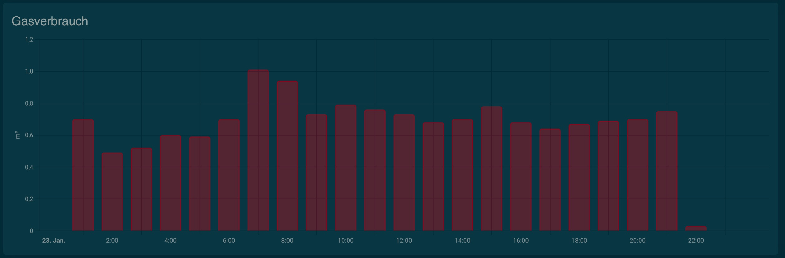

# Embedding a gas meter using home assistant ESPhome

In this repo I am going to document my setup for reading my gas meter using a ESP8266 and a reed sensor and display it in Home Assistant.

It is based on [this blog post by Benni](https://be-jo.net/2022/02/home-assistant-gaszaehler-mit-esphome-auslesen-flashen-unter-wsl/) translating it to English, adding some more details on the overall setup and extending it with (for me) important features.

First of all let's have a look at what we want to achieve:

# Needed hardware

## Home Assistant

If you don't have a running installation of Home Assistant you will need some hardware to run it on. There are many option [as described on this page](https://www.home-assistant.io/installation/) but be aware it should be a 24/7 running machine so most people are either running it on a Raspberry Pi or a NUC. I am running it on a Raspberry Pi 3 (and will upgrade to a 4 the moment they get back to normal prices).

## The sensor

The sensor is based on a ES2866 board which you can get from many source incl. Amazon. Be aware there are many, many replicas in the market, I personally have chosen [this D1 Mini](https://www.amazon.de/dp/B0754N794H?psc=1&ref=ppx_yo2ov_dt_b_product_details).

Next to this you need a so called reed sensor which is going to react on the actual gas meter which has an electromagnet inside.

Next you need an USB power source (USB micro if you choose the same D1 Mini as I did).

Finally some short electronic cables and a soldering iron.

So the costs of the ESP8266 and the reed sensor are below 10€ in total.

## Optional: a nice case

As I also own a 3D printer I have printed [a nice case for the my gas meter produced by Elster](https://www.thingiverse.com/thing:5574503) but your gas meter may vary and the case is not strictly needed. Some duct tape will do the job as well.

## Wiring the sensor

